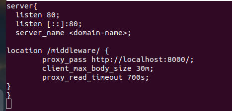

# Setup of Nginx reverse proxy server


**Nginx reverse proxy configuration steps**

1. Install Nginx on your Linux machine
2. Add the Nginx proxy_pass setting in a virtual host or the default config file.
3. Map a context root to the URL of a backend server.
4. Restart Nginx reverse proxy and test the reverse proxy setup.


**Install Nginx**

On Ubuntu, install the latest version of Nginx. Perform the apt-get update and apt-get upgrade commands, followed by the apt-get install command.

```
sudo apt-get update -y
sudo apt-get upgrade -y

sudo apt-get install nginx -y
```

How to verify an Nginx Install?

```
sudo systemctl status nginx
```


Add an Nginx proxy_pass setting

The most important configuration step in an Nginx reverse proxy configuration is the addition of a proxy_pass setting that maps an incoming URL to a backend server.

In this Nginx reverse proxy example, we assume a Middleware service is running on Docker Container at port **`8000`**, and we need Nginx to proxy an application with the context root of /middleware.




Test Nginx Configuration file.
```
nginx -t
```


Adding TLS to your Nginx Reverse Proxy using Let’s Encrypt

Important: Make sure your domain name points towards your server ip (A or AAAA record).


Install Certbot on your Instance by using the APT packet manager:

```
apt-get update
apt-get install software-properties-common
add-apt-repository ppa:certbot/certbot
apt-get update
apt-get install python3-certbot-nginx
```

Certbot provides a plugin designed for the Nginx web server, automatizing most of the configuration work related with requesting, installing and managing the TLS certificate:

```
certbot --nginx
```

Restart Nginx as a reverse proxy

To see Nginx function as a reverse proxy, simply restart the server to load the new configuration.

```
sudo systemctl restart nginx
```


