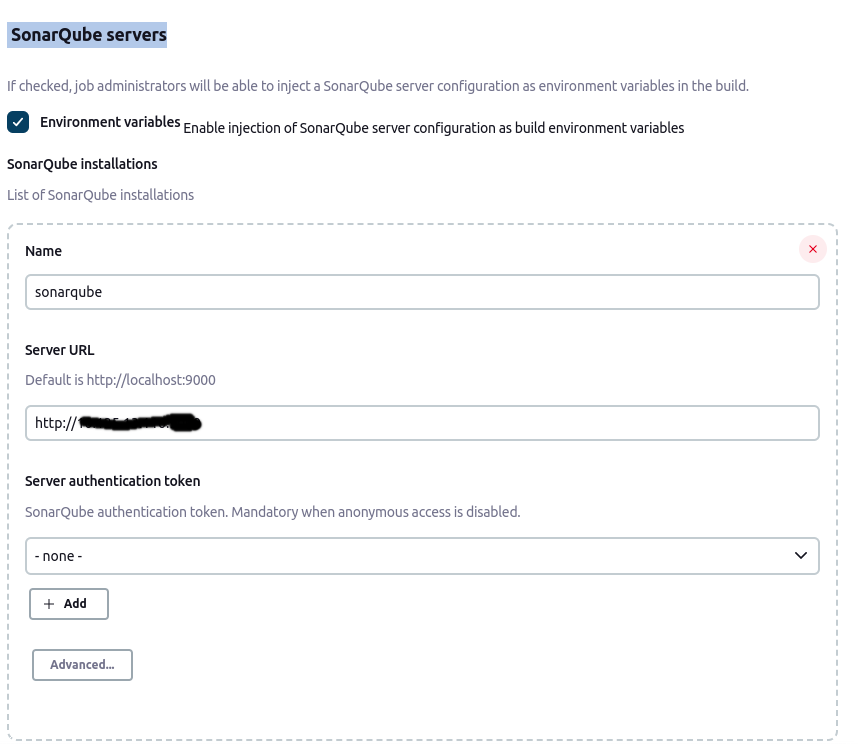
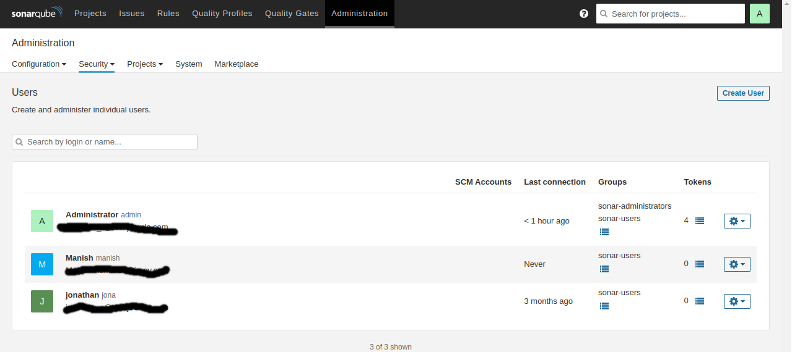

# Integrate Sonarqube with Jenkins Build Pipeline

In this scenario for Continuous Inspection and Continuous Integration of the code. We will follow the best practice using Gitlab-Jenkins-SonarQube Integration for this scenario.

Flow : As soon as developer commits the code to Gitlab, Jenkins will fetch/pull the code from the repository and will perform static code analysis with help of Sonar Scanner and send analysis report to SonarQube Server then it will automatically build the project code.

**`Step 1`**: Install SonarQube plugin to Jenkins. Go to Manage Jenkins > Manage Plugins > Available > Search for SonarQube Scanner> Install.(in my case I already have)

**`Step 2`**: Setup SonarQube with Jenkins

Go to Manage Jenkins > Configure system > SonarQube server section > Add SonarQube > Name it, provide Server Url as http://IP:port > and authentication token copied from SonarQube Server > Apply and Save

**`Step 3`**: Configure Sonar Scanner in Jenkins

Go to Manage Jenkins -> Global Tool Configuration -> Scroll for SonarQube Scanner -> Add sonar scanner -> name it,
uncheck if you already have sonar else it will automatically download for you and your sonar scanner setup will be done(in my case I already have)

**`Step 4`**: Open SonarQube server

Go to Administration > click on Security > Users > Click on Tokens > Generate token with some name > it will be used in Jenkins for Sonar authentication.

